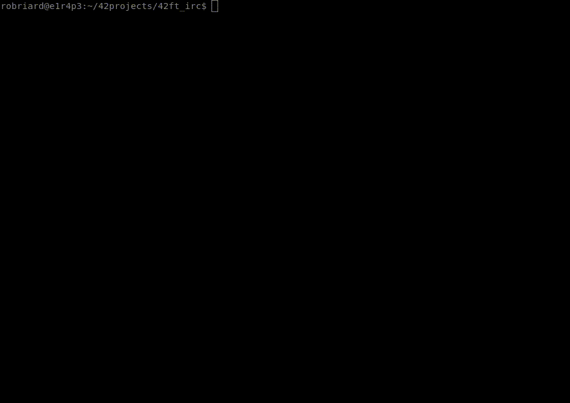

[comment]: <> (README for ft_irc project, generated by robriard)

[comment]: <> (presentation of the project)
<h1 style="text-align: center;">FT_IRC</h1>

[](https://choosealicense.com/licenses/mit/) [](https://bitbucket.org/lbesson/ansi-colors) [](https://svgshare.com/i/Zhy.svg)

<p style="text-align: center;">
ft_irc is a 42 school project. we need to build a irc chat server in C++98 and following RFC norm
</p>

<h2 style="text-align: center;">GETTING STARTED</h2>




[comment]: <> (insatllation, usage with exemple and makefile)
<h2 style="text-align: center;">INSTALLATION</h2>

```bash
git clone https://github.com/robriard/42ft_irc.git;
cd 42ft_irc;
make
```
<h2 style="text-align: center;">USAGE</h2>

```bash
./ircserv [port] [password]
```
>[port] is the port on which the server will listen, is a mandatory argument

>[password] is the password to connect to the server, is an optional argument

### EXAMPLE
>```./ircserv 6667 my_password```

>```./ircserv 6667```

### MAKEFILE
>you can use the makefile to build the project: ```make``` | ```make all``` | ```make debug```,

>if you want remove objects files and binary: ```make clean```  | ```make fclean```,

>if you want recompile the project: ```make re```.


[comment]: <> (configuration of the server)
<h2 style="text-align: center;">CONFIGURATION</h2>

>you can change the configuration of the server in the config file
```bash
vim config/default.conf
```
>|     KEY     |                      DESCRIPTION                     |
>|-------------|------------------------------------------------------|
>|  password   |              same of [password] argument             |
>|    host     |                IP adress of the server               |
>|     max     |             max number of users connected            |
>|   backlog   |        max size of queu of pending connections       |
>|    ping     |       time in ms between every connection test       |
>|   timeout   |time in ms before to be quicked out (more of 2*[ping])|
>|    motd     |    path to te file contain the message of the day    |
>|  oper_user  |     username to give for become a server operator    |
>|oper_password|     password to give for become a server operator    |

>>[password] config key can be removed if you give the password in argument

